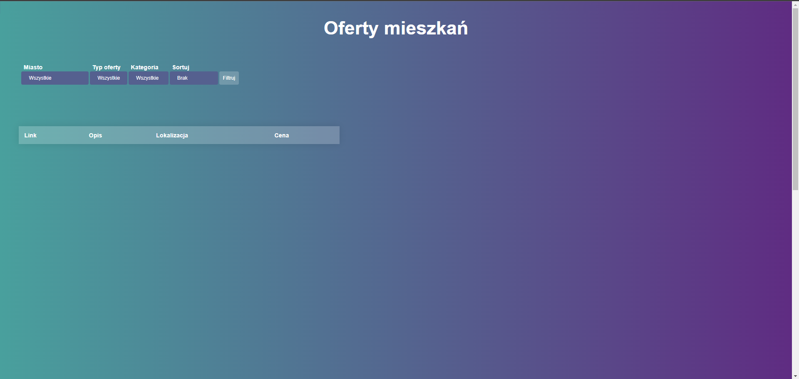
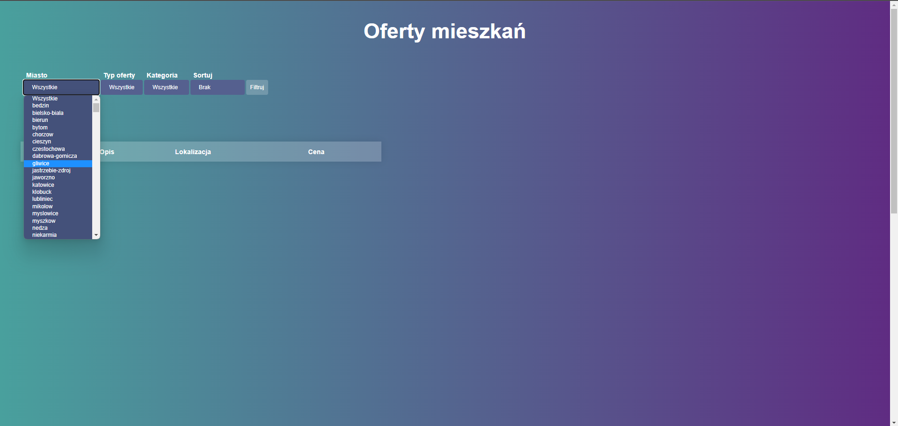
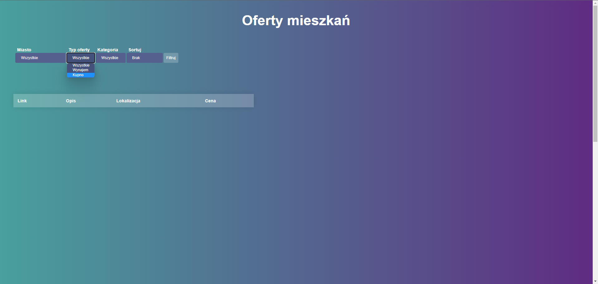
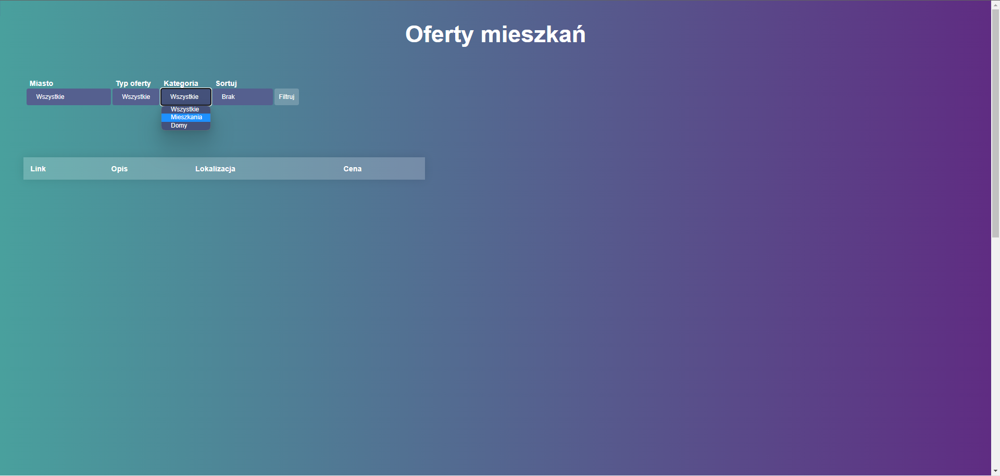
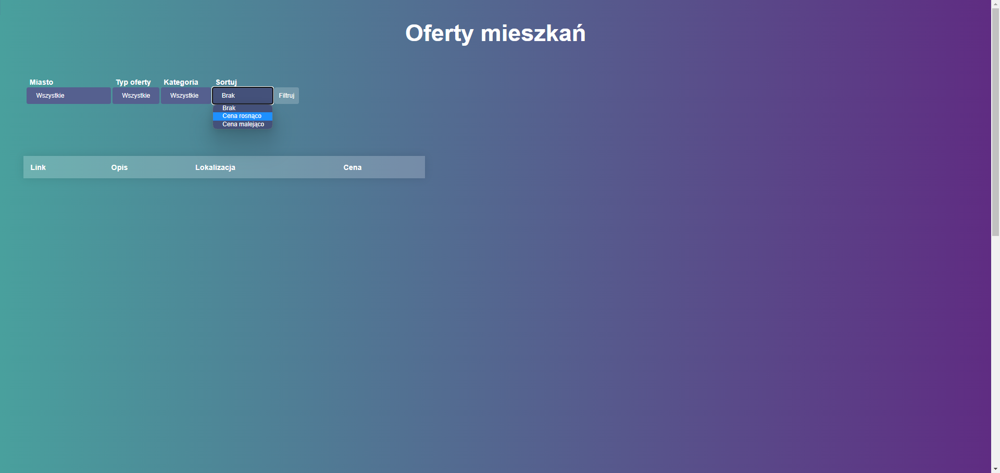
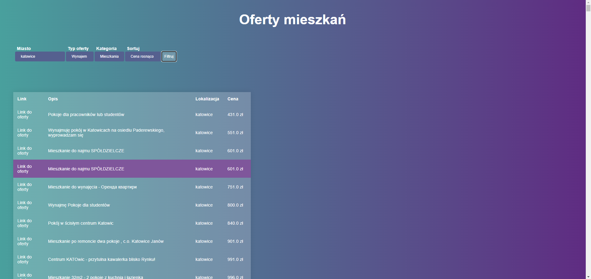
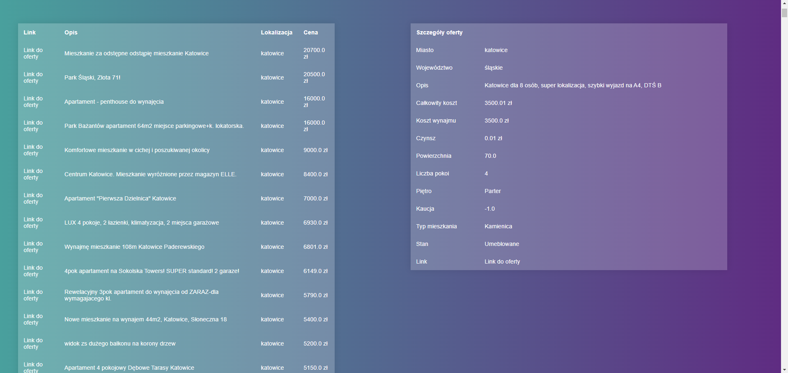

# Backend API and frontend

## How to run locally 
```
python -m venv venv
```
```
pip install -r requirements.txt
```
```
uvicorn src.app:app --reload
```

## Preview
<p align="center">

</p>
<p align="center">

</p>
<p align="center">

</p>
<p align="center">

</p>
<p align="center">

</p>
<p align="center">

</p>
<p align="center">

</p>